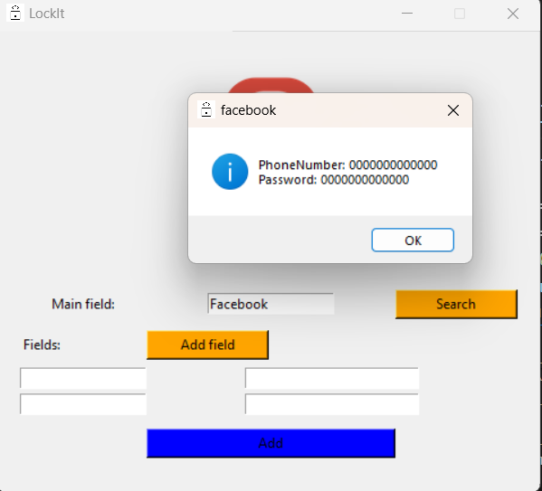

# LockIt 🔐  
A Simple JSON-Based Password & Data Manager

## 🌍 Overview  
LockIt is a lightweight desktop app built with Python and Tkinter that lets you store and look up information such as website logins, app accounts, or any other key–value data.

Instead of being limited to fixed fields (like just website/email/password), LockIt lets you:

- Choose a **main entry name** such as `github`, `facebook`, `bank`, `work-email`
- Add as many **subfields** (key/value pairs) as you want such as `Email`, `Username`, `Password`, `Note`
- Save everything into a local `data.json` file
- Search by the main entry name and see all stored subfields in a popup

---

## 🚀 Features

- **Generic Entries**
  - Main field can be anything: website name, service, app, etc.
  - Add dynamic subfields (key/value) like:
    - `Email: your@email.com`
    - `Username: johndoe`
    - `Password: superSecret123!`
    - `Note: personal account`

- **JSON Storage**
  - Data is stored in a `data.json` file in the project folder.
  - If the file doesn’t exist, it is created automatically.
  - Entries are stored like:
    ```json
    {
      "github": {
        "Email": "you@example.com",
        "Username": "myuser",
        "Password": "mypassword"
      }
    }
    ```

- **Search Functionality**
  - Type the main entry name and click **Search**.
  - If it exists, all subfields are shown in a popup.
  - If not, you get a friendly “no entry found” message.

- **Clean Tkinter UI**
  - Custom lock icon (`lock.png`).
  - “Add field” button to create more subfield rows.
  - “Add” button to save/update entries in `data.json`.

---

## 🛠 Technologies Used

- **Python 3**
- **Tkinter** – GUI framework
- **json** – for reading/writing the data file

No external third-party packages are required.

---

▶️ Quick Start: Run LockIt

1. **Clone the repo**

   ```bash
   git clone https://github.com/L-YS-Ayoussef/LockIt-Simple-Password-Data-Manager.git
   cd LockIt-Simple-Password-Data-Manager
   
2. **Create and activate a virtual environment**
  - **Windows**:
     ```bash
     python -m venv venv
    venv\Scripts\activate
     
  - **macOS / Linux**:
    ```bash
     python3 -m venv venv
    source venv/bin/activate
  
3. **Run the app**

   ```bash
   python PROJECT.py

## 🖼️ App Screenshots

### LockIt


### Search Data



## 📜 License
This project is **open-source** and available for anyone to use, modify, and distribute.

**Copyright © 2025 Chameleon Tech** 
