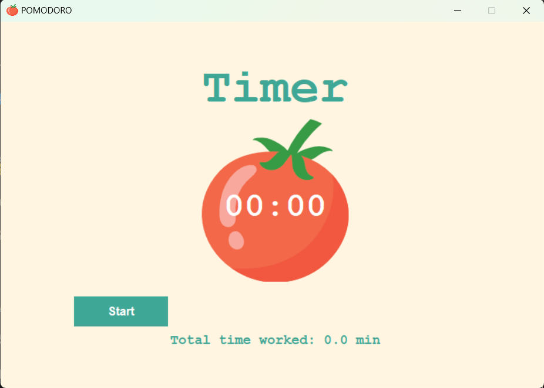
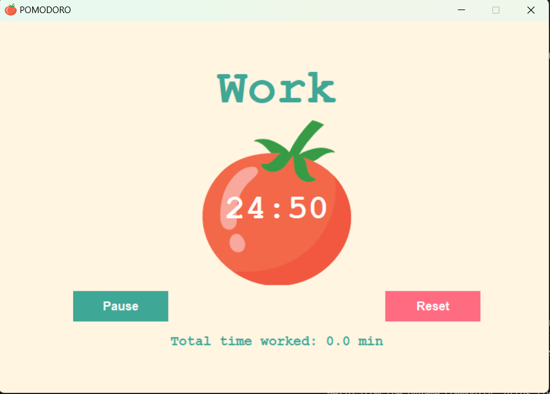

# Pomodoro ⏱️  
A Fun Focus Timer Built with Python

🌍 Overview  
Pomodoro is a simple desktop productivity timer built with Python using Tkinter for the GUI and Pygame for sound. It follows the Pomodoro technique: focused work sessions followed by short breaks, with visual checkmarks and an alarm to keep you on track.

---

## 🚀 Features

- **Work & Break Cycles**  
  Automatically alternates between work sessions, short breaks, and long breaks after several cycles.

- **Controls**  
  - **Start** – begin the timer  
  - **Pause / Resume** – temporarily stop and continue  
  - **Reset** – reset timer, counters, and progress

- **Progress Tracking**  
  - ✔ added after each completed work session  
  - Checkmarks grouped **4 per line** to represent a full Pomodoro cycle  
  - Displays **total time worked** in minutes

- **Audio Alarm**  
  - Plays `alarm.mp3` when a timer finishes  
  - Alarm stops when you hit **Reset**

- **Polished UI**  
  - Tkinter-based interface with consistent styling  
  - Fixed window size and a `tomato.png` icon

---

## 🛠 Technologies Used

- **Python 3**
- **Tkinter** – GUI
- **Pygame** – audio playback (`alarm.mp3`)

---

## ▶️ Quick Start: Run & Use the App

1. **Clone the repo**

   ```bash
   git clone https://github.com/L-YS-Ayoussef/Pomodoro.git
   cd Pomodoro
   
2. **Create and activate a virtual environment**
- **Windows**:
   ```bash
   python -m venv venv
  venv\Scripts\activate
   
- **macOS / Linux**:
  ```bash
   python3 -m venv venv
  source venv/bin/activate
  
3. **Install dependencies**

   ```bash
   pip install -r requirements.txt

4. **Run the app**

   ```bash
   python Project.py

## 🖼️ App Screenshots

### Timer


### Work



## 📜 License
This project is **open-source** and available for anyone to use, modify, and distribute.

**Copyright © 2022 Chameleon Tech** 
